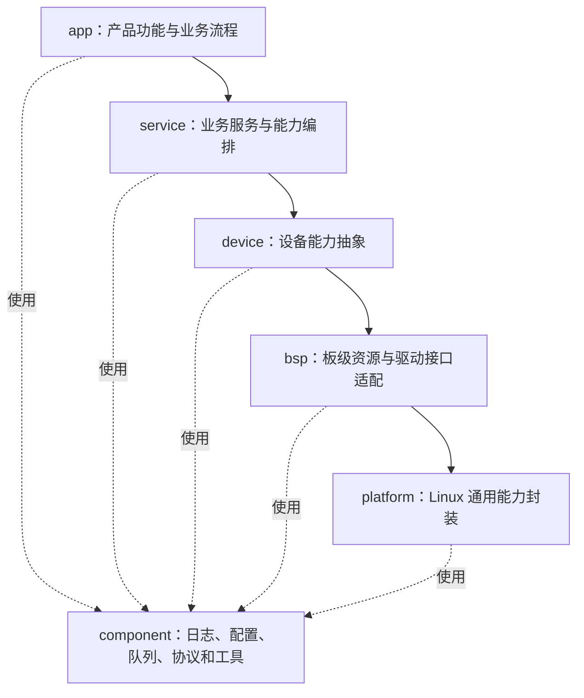
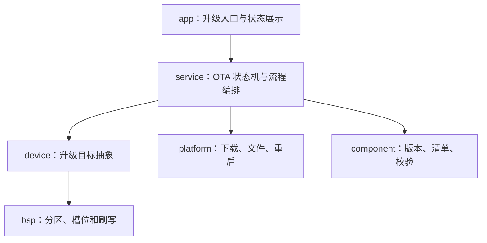
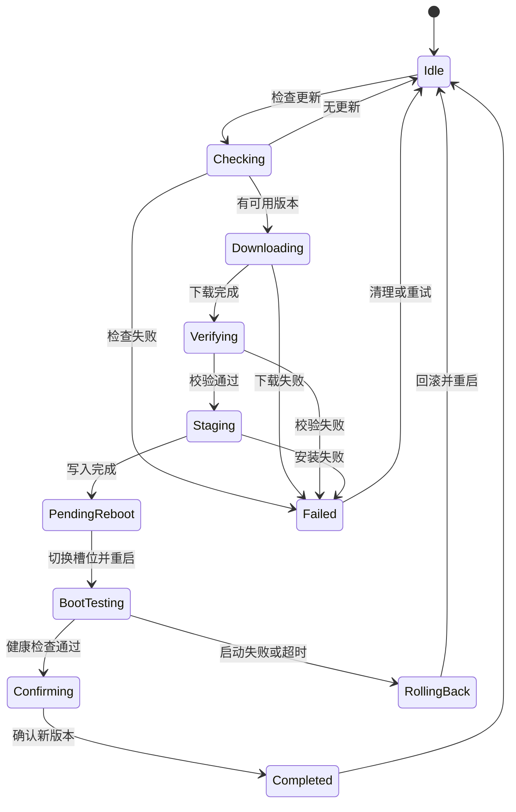

# 嵌入式软件分层架构

> 适用范围：以 C++ 为主要开发语言的嵌入式 Linux 应用程序。分层方法也可迁移到 RTOS 项目。  
> 重点：规划各层职责、依赖方向、C++ 工程组织，以及可落地的 OTA 升级框架。

---

## 一、为什么必须分层

嵌入式 C++ 应用通常会同时发生以下变化：

| 变化类型 | 常见变化 |
| --- | --- |
| 设备变化 | 摄像头、串口设备、传感器、显示屏、通信模组或执行器更换 |
| 平台变化 | SoC、Linux 发行版、文件系统、驱动接口或厂商 SDK 更换 |
| 业务变化 | 命令定义变化、控制策略升级、状态机调整或工作流程改变 |
| 通信变化 | TCP、UDP、串口协议、MQTT、ROS 2 或其他通信方式改变 |

不分层时的典型症状：

- 业务代码直接调用 `open`、`read`、`write`、`ioctl`；
- 更换摄像头或串口协议时，大量业务代码跟着修改；
- 一个源文件同时包含业务流程、线程、Socket、设备节点和日志；
- 上层直接依赖某个厂商 SDK，后续很难替换；
- 某个底层函数修改后，多个无关模块同时受影响；
- 单元测试必须连接真实硬件才能运行；
- 代码不是不能工作，而是越来越难维护、复用和测试。

分层的目标是让不同类型的问题在各自边界内闭环，并利用 C++ 接口、命名空间和构建目标把边界落实到代码：

- 业务变化主要修改 `app` 和 `service`；
- 设备变化主要修改 `device` 和 `bsp`；
- Linux 平台变化主要修改 `platform`；
- 通用能力由 `component` 提供，避免重复实现。

---

## 二、推荐的六层架构

从上到下越接近硬件；`component` 是供多层复用的横向通用层。

| 层 | 名称 | 定位 |
| --- | --- | --- |
| **app** | 应用层 | 吸收产品和业务变化 |
| **service** | 服务层 | 提供稳定的业务通用能力 |
| **device** | 设备层 | 吸收同类设备之间的差异 |
| **bsp** | 板级支持层 | 吸收板级资源和驱动接口差异 |
| **platform** | 平台层 | 封装 Linux 用户态平台能力 |
| **component** | 组件层 | 提供与具体业务无关的横向通用组件 |

推荐关系及基本依赖方向：



> `component` 可以被多个层使用，但不得反向依赖具体产品业务。

C++ 工程中的对应关系：

| 层级 | 建议 CMake target | 主要代码形态 |
| --- | --- | --- |
| `app` | `project_app_core` | 产品流程、控制器和对外接口 |
| `service` | `project_service` | 业务服务接口与实现 |
| `device` | `project_device` | 纯虚设备接口、设备模型与适配逻辑 |
| `bsp` | `project_bsp` | Linux/驱动/厂商 SDK 的具体实现类 |
| `platform` | `project_platform` | OS 能力接口与 Linux 实现 |
| `component` | `project_component` | 通用库、模板类、基础类型 |

每层应构建为独立库或目标，禁止把所有源码直接编译进一个可执行文件后仅靠目录“假分层”。`main.cpp` 单独作为组合根，只负责创建并连接对象。

---

## 三、各层职责详解

### 1. app——应用层

**核心职责：回答“这个产品要做什么”。**

负责：

- 产品功能入口；
- 业务流程编排；
- 产品级状态机；
- 用户命令或外部请求处理；
- 多个服务之间的组合；
- CLI、HTTP、RPC、ROS 2 节点等对外入口；
- 应用启动、运行和退出流程；
- 将底层错误转换为产品可理解的状态。

不负责：

- 不直接访问 `/dev/*`；
- 不直接调用 `ioctl`、V4L2、termios 或厂商 SDK；
- 不直接实现串口收发、Socket 收发或文件读写细节；
- 不关心设备使用哪个驱动、波特率或硬件型号；
- 不重复实现日志、配置、队列等通用能力。

典型模块：

```text
app/
├── main.cpp
├── application.cpp
├── product_controller.cpp
├── system_state_machine.cpp
├── command_dispatcher.cpp
└── api/
    ├── cli_api.cpp
    ├── http_api.cpp
    └── ros_node.cpp
```

应用层接口示例：

```cpp
class ProductController {
public:
    Result Start();
    Result Stop();
    Result ExecuteCommand(const ProductCommand& command);
    ProductStatus GetStatus() const;
};
```

判断标准：

> 如果需求文档发生变化，这段代码是否大概率需要修改？如果是，通常属于 `app`。

---

### 2. service——服务层

**核心职责：回答“业务能力怎样稳定地提供给应用层”。**

服务层位于应用和设备之间，将多个底层能力组合成可复用服务。

负责：

- 可复用的业务能力；
- 业务用例执行；
- 多设备协作；
- 数据采集、处理、保存和上传流程；
- 控制策略或任务流程的组织；
- 业务级超时、重试和降级；
- 对上层提供稳定、简单的接口。

不负责：

- 不处理具体设备节点；
- 不直接调用 Linux 系统调用或厂商 SDK；
- 不包含具体产品页面、按钮或命令解析；
- 不把具体硬件型号暴露给 `app`；
- 不承担与业务无关的通用工具功能。

典型模块：

```text
service/
├── acquisition_service.cpp
├── control_service.cpp
├── storage_service.cpp
├── stream_service.cpp
├── health_service.cpp
└── update_service.cpp
```

服务层接口示例：

```cpp
class IAcquisitionService {
public:
    virtual ~IAcquisitionService() = default;
    virtual Result Start(const AcquisitionOptions& options) = 0;
    virtual Result Stop() = 0;
    virtual AcquisitionStatus GetStatus() const = 0;
};
```

判断标准：

> 这项能力是否可以被多个产品功能复用，但又带有明确业务含义？如果是，通常属于 `service`。

---

### 3. device——设备层

**核心职责：回答“上层怎样以统一方式使用某一类设备”。**

设备层面向“设备能力”，不面向 Linux 文件描述符。

负责：

- 定义统一的设备接口；
- 屏蔽同类设备的型号和厂商差异；
- 设备初始化、启动、停止和状态管理；
- 将原始数据转换为统一业务数据；
- 设备级参数检查；
- 设备级错误转换；
- 设备掉线检测和恢复；
- 提供 Fake/Mock 设备供测试使用。

不负责：

- 不编排完整产品业务；
- 不处理 UI、HTTP 或产品命令；
- 不在接口中暴露 `fd`、`errno` 或厂商 SDK 类型；
- 不把 `open/read/ioctl` 散落在多个设备类中；
- 不处理与设备无关的系统能力。

典型模块：

```text
device/
├── camera/
│   ├── i_camera.hpp
│   ├── camera_device.cpp
│   └── fake_camera.cpp
├── serial_sensor/
│   ├── i_sensor.hpp
│   ├── sensor_device.cpp
│   └── sensor_protocol.cpp
└── actuator/
    ├── i_actuator.hpp
    └── actuator_device.cpp
```

设备接口示例：

```cpp
class ICamera {
public:
    virtual ~ICamera() = default;
    virtual Result Open(const CameraConfig& config) = 0;
    virtual Result Start() = 0;
    virtual Result ReadFrame(Frame& frame, Milliseconds timeout) = 0;
    virtual Result Stop() = 0;
    virtual void Close() = 0;
};
```

判断标准：

> 更换同类设备型号时，上层接口是否应该保持不变？如果是，差异应收敛在 `device`。

---

### 4. bsp——板级支持层

**核心职责：回答“当前板卡怎样访问驱动和板级资源”。**

这里的 `bsp` 指 Linux **用户态板级适配**，不包含内核驱动内部实现。

负责：

- 封装 `/dev/*` 设备节点；
- 封装 `sysfs`、`procfs` 中项目需要的接口；
- 封装 `open/read/write/close/ioctl/mmap/poll`；
- UART、I2C、SPI、GPIO、PWM、CAN 等用户态访问；
- V4L2、ALSA、DRM 等 Linux 设备接口适配；
- 对接板卡厂商提供的用户态 SDK；
- 处理短读写、`EINTR`、`EAGAIN`、超时和设备重连；
- 管理文件描述符和 SDK 句柄生命周期。

不负责：

- 不包含产品业务；
- 不定义产品状态机；
- 不解析上层业务命令；
- 不直接被 `app` 调用；
- 不将 `fd`、`errno` 或 SDK 私有结构体暴露给上层；
- 不修改 Linux 内核或驱动内部逻辑。

典型模块：

```text
bsp/
├── uart/
│   ├── uart_port.cpp
│   └── termios_config.cpp
├── gpio/
│   └── gpiod_adapter.cpp
├── video/
│   └── v4l2_capture.cpp
├── audio/
│   └── alsa_device.cpp
├── can/
│   └── socketcan_adapter.cpp
└── vendor/
    └── vendor_sdk_adapter.cpp
```

BSP 接口示例：

```cpp
class IUartPort {
public:
    virtual ~IUartPort() = default;
    virtual Result Open(const UartConfig& config) = 0;
    virtual Result Write(ByteView data, Milliseconds timeout) = 0;
    virtual Result Read(MutableByteView buffer,
                        std::size_t& received,
                        Milliseconds timeout) = 0;
    virtual void Close() = 0;
};
```

判断标准：

> 更换板卡、设备节点、驱动 ABI 或厂商 SDK 时需要修改的代码，通常属于 `bsp`。

---

### 5. platform——平台层

**核心职责：回答“上层怎样使用 Linux 通用能力而不绑定具体实现”。**

负责：

- 线程、互斥锁、条件变量和信号量封装；
- 时间、定时器和休眠；
- 文件、目录和路径操作；
- 进程、信号和守护进程能力；
- TCP、UDP、Unix Domain Socket 等基础网络能力；
- 共享内存、消息队列等 IPC 基础能力；
- 动态库加载；
- 系统信息、CPU、内存和磁盘信息读取；
- 统一封装平台差异和系统错误。

不负责：

- 不包含业务流程；
- 不定义具体设备含义；
- 不实现产品通信协议；
- 不依赖 `app`、`service` 或 `device`；
- 不为了“封装而封装”，只封装项目确实需要隔离或替换的能力。

典型模块：

```text
platform/
├── thread/
├── time/
├── filesystem/
├── network/
├── ipc/
├── process/
├── signal/
└── system/
```

平台接口示例：

```cpp
class IClock {
public:
    virtual ~IClock() = default;
    virtual SteadyTime Now() const = 0;
    virtual void SleepFor(Milliseconds duration) = 0;
};
```

判断标准：

> 这段代码是在使用 Linux 的通用能力，且未来可能需要被测试替身或其他平台实现替换吗？如果是，通常属于 `platform`。

---

### 6. component——组件层

**核心职责：提供与具体产品、设备和板卡无关的通用能力。**

负责：

- 日志；
- 配置文件解析与校验；
- 错误码和 `Result` 类型；
- 环形缓冲区、线程安全队列和对象池；
- CRC、校验和、编解码；
- JSON、YAML、Protobuf 等数据转换；
- 通用协议解析框架；
- 事件总线、观察者和回调管理；
- 通用数学、字符串和字节工具；
- 性能统计与诊断工具。

不负责：

- 不出现具体产品名称；
- 不出现具体设备型号；
- 不包含产品状态机；
- 不依赖上层业务模块；
- 不把某个项目的特殊逻辑包装成“通用组件”。

典型模块：

```text
component/
├── logging/
├── config/
├── error/
├── buffer/
├── queue/
├── codec/
├── event/
├── metrics/
└── utility/
```

判断标准：

> 将该模块复制到另一个完全不同的项目中，是否仍然具有明确用途？如果是，通常属于 `component`。

---

## 四、OTA 升级框架

### 1. OTA 在分层架构中的位置

OTA 是一条跨层业务链路，不作为新的基础层。各层只负责自己边界内的升级能力：

| 层级 | OTA 职责 | 建议模块 |
| --- | --- | --- |
| `app` | 接收升级命令、展示进度、维护产品级升级策略 | `ota_controller`、`ota_api` |
| `service` | OTA 状态机、流程编排、前置检查、失败恢复 | `ota_service`、`ota_state_machine` |
| `device` | 抽象不同升级目标，如系统、应用、MCU、FPGA | `i_update_target`、`system_target`、`mcu_target` |
| `bsp` | A/B 槽位、Bootloader 环境、分区和板级刷写 | `boot_control`、`slot_manager`、`flash_writer` |
| `platform` | HTTP、文件、网络、进程、重启和安全存储 | `http_client`、`file_system`、`rebooter` |
| `component` | 版本比较、Manifest、哈希、签名、进度模型 | `semver`、`manifest`、`package_verifier` |

依赖方向：



### 2. OTA 目标与边界

OTA 框架应支持以下升级目标中的一种或多种：

| 升级目标 | 内容 | 推荐策略 |
| --- | --- | --- |
| 系统镜像 | Kernel、DTB、RootFS、系统服务 | A/B 分区升级 |
| C++ 应用 | 可执行文件、动态库、资源文件 | 双版本目录 + 原子软链接切换 |
| 配置 | 默认配置、Schema、迁移脚本 | 版本化迁移 + 回滚备份 |
| MCU 固件 | 外部 MCU、飞控或传感器固件 | 设备层目标 + BSP 传输实现 |
| FPGA/其他固件 | bitstream 或厂商固件包 | 专用目标 + 完整性校验 |

OTA 框架负责：

- 检查版本与硬件兼容性；
- 下载和断点续传；
- 包完整性与数字签名校验；
- 空间、电量、温度和业务状态等前置检查；
- 安装到非活动槽位或新版本目录；
- 原子切换、重启、启动确认和失败回滚；
- 保存进度、错误原因和审计记录。

OTA 框架不负责：

- 不绕过 Bootloader 或分区安全机制；
- 不允许业务层直接写块设备；
- 不使用普通哈希代替数字签名鉴权；
- 不在未完成校验前执行安装；
- 不在状态机外部零散修改升级状态。

### 3. OTA 状态机



状态要求：

| 状态 | 允许操作 | 必须持久化的信息 | 失败处理 |
| --- | --- | --- | --- |
| `Idle` | 检查更新 | 当前版本、活动槽位 | 无 |
| `Checking` | 拉取并解析 Manifest | 请求 ID、候选版本 | 返回空闲 |
| `Downloading` | 下载、暂停、恢复、取消 | URL、ETag、偏移、临时文件 | 有界重试 |
| `Verifying` | 哈希和签名校验 | 包哈希、签名结果 | 删除无效包 |
| `Staging` | 写非活动槽或新版本目录 | 目标槽、写入进度 | 保持旧版本可启动 |
| `PendingReboot` | 设置启动槽、安排重启 | 新槽位、尝试次数 | 未重启可恢复 |
| `BootTesting` | 执行启动健康检查 | 启动截止时间 | 超时自动回滚 |
| `Confirming` | 确认当前槽位有效 | 已确认版本 | 失败则回滚 |
| `RollingBack` | 切回旧版本 | 回滚原因 | 进入旧版本 |
| `Failed` | 查看错误、清理、重新开始 | 阶段、错误码、重试次数 | 不破坏当前版本 |

状态只能由 `OtaStateMachine` 修改。状态变更应先持久化，再执行不可逆操作。

### 4. OTA 服务接口

```cpp
namespace project::service {

enum class OtaState {
    kIdle,
    kChecking,
    kDownloading,
    kVerifying,
    kStaging,
    kPendingReboot,
    kBootTesting,
    kConfirming,
    kRollingBack,
    kCompleted,
    kFailed,
};

struct OtaProgress {
    OtaState state;
    std::uint8_t percent;
    std::uint64_t completed_bytes;
    std::uint64_t total_bytes;
    std::string current_version;
    std::string target_version;
    std::optional<Error> last_error;
};

class IOtaService {
public:
    virtual ~IOtaService() = default;

    virtual Result<UpdateInfo> Check(const UpdateChannel& channel) = 0;
    virtual Result<void> Start(const UpdateRequest& request) = 0;
    virtual Result<void> Pause() = 0;
    virtual Result<void> Resume() = 0;
    virtual Result<void> Cancel() = 0;
    virtual OtaProgress GetProgress() const = 0;
    virtual Result<void> ConfirmCurrentVersion() = 0;
    virtual Result<void> RequestRollback() = 0;
};

}  // namespace project::service
```

调用约束：

- `Start` 必须是幂等的，同一升级任务重复请求不能重复刷写；
- `Pause/Resume` 只对可恢复下载阶段有效；
- 进入写入阶段后是否允许取消必须由目标实现明确；
- 进度回调不得在 OTA 内部锁持有期间调用；
- 外部 API 不得直接设置内部状态。

### 5. 升级目标抽象

不同升级目标通过统一接口接入 OTA 服务：

```cpp
namespace project::device {

struct StageContext {
    std::filesystem::path package_path;
    PackageManifest manifest;
    std::string target_slot;
};

class IUpdateTarget {
public:
    virtual ~IUpdateTarget() = default;

    virtual std::string_view Name() const noexcept = 0;
    virtual Result<void> PreflightCheck(const PackageManifest& manifest) = 0;
    virtual Result<void> Prepare(const StageContext& context) = 0;
    virtual Result<void> Write(const StageContext& context,
                               ProgressCallback progress) = 0;
    virtual Result<void> VerifyWrittenData(const StageContext& context) = 0;
    virtual Result<void> Activate() = 0;
    virtual Result<void> Rollback() = 0;
};

}  // namespace project::device
```

建议实现：

```text
device/update/
├── i_update_target.hpp
├── system_image_target.cpp
├── application_target.cpp
├── configuration_target.cpp
├── mcu_firmware_target.cpp
└── fpga_firmware_target.cpp
```

设备层负责目标语义，例如“更新 MCU 固件”；BSP 负责具体通过 UART、USB、CAN 或厂商工具写入。

### 6. A/B 槽位与 Boot Control

系统镜像 OTA 优先采用 A/B 分区：

| 项目 | 槽位 A | 槽位 B |
| --- | --- | --- |
| 当前活动槽 | 运行中 | 非活动 |
| OTA 写入 | 禁止覆盖 | 写入新版本 |
| 下次启动 | 保持 | 标记为待验证 |
| 启动成功 | A 保留为回滚槽 | B 确认为活动槽 |
| 启动失败 | 自动切回 A | B 标记失败 |

Boot Control 接口：

```cpp
namespace project::bsp {

struct SlotInfo {
    std::string active_slot;
    std::string inactive_slot;
    bool current_slot_confirmed;
    std::uint32_t remaining_boot_attempts;
};

class IBootControl {
public:
    virtual ~IBootControl() = default;

    virtual Result<SlotInfo> GetSlotInfo() const = 0;
    virtual Result<void> SetNextBootSlot(std::string_view slot,
                                         std::uint32_t attempts) = 0;
    virtual Result<void> ConfirmCurrentSlot() = 0;
    virtual Result<void> MarkCurrentSlotFailed() = 0;
    virtual Result<void> RequestRollback() = 0;
};

}  // namespace project::bsp
```

Bootloader 必须具备：

- 启动尝试次数计数；
- 未确认版本自动回滚；
- 槽位元数据冗余或校验；
- 掉电后仍能确定有效启动槽；
- 不允许用户空间随意把损坏槽位标记为成功。

如果只能升级单个 C++ 应用，可使用双版本目录：

```text
/opt/application/
├── versions/
│   ├── 1.4.2/
│   └── 1.5.0/
├── current -> versions/1.4.2
└── previous -> versions/1.3.8
```

安装完成后使用原子方式切换 `current`，并保留 `previous` 供服务启动失败时回退。

### 7. OTA 包与 Manifest

推荐升级包结构：

```text
update-package/
├── manifest.json
├── manifest.sig
├── payload/
│   ├── rootfs.img
│   ├── application.tar.zst
│   └── mcu.bin
└── migration/
    └── migrate-config
```

Manifest 至少包含：

```json
{
  "format_version": 1,
  "release_version": "1.5.0",
  "product": "product-family",
  "hardware_compatibility": ["board-v2", "board-v3"],
  "minimum_bootloader_version": "2.1.0",
  "minimum_current_version": "1.2.0",
  "rollback_allowed": true,
  "payloads": [
    {
      "target": "system",
      "file": "payload/rootfs.img",
      "size": 536870912,
      "sha256": "<sha256>"
    }
  ]
}
```

规则：

- 签名覆盖完整 Manifest；
- Manifest 中记录每个 payload 的大小和哈希；
- 公钥或信任根必须位于受保护位置，不能随升级包一起替换；
- 验证产品型号、硬件版本和最低 Bootloader 版本；
- 版本比较使用语义版本对象，不使用普通字符串比较；
- 是否允许降级由签名策略和防回退计数共同决定。

### 8. 下载与断点续传

平台层提供通用下载接口：

```cpp
namespace project::platform {

struct DownloadRequest {
    std::string url;
    std::filesystem::path destination;
    std::optional<std::string> etag;
    std::uint64_t resume_offset;
    Milliseconds connect_timeout;
    Milliseconds read_timeout;
};

class IDownloader {
public:
    virtual ~IDownloader() = default;
    virtual Result<DownloadResult> Download(
        const DownloadRequest& request,
        ProgressCallback progress,
        CancellationToken& cancellation) = 0;
};

}  // namespace project::platform
```

下载要求：

- 临时文件使用 `.part` 后缀，验证成功后原子重命名；
- 使用 ETag、Last-Modified 或服务端版本标识验证续传对象未变化；
- 定期持久化下载偏移，避免每个数据块都同步磁盘；
- 限制包大小、下载速度、重试次数和磁盘占用；
- 下载目录与运行数据分开，并设置配额；
- 下载完成不等于可信，必须进入独立验证阶段。

### 9. 安全校验顺序

校验必须按以下顺序执行：

1. 限制文件大小和包结构，防止路径穿越与解压炸弹；
2. 验证 Manifest 数字签名；
3. 验证产品、硬件和 Bootloader 兼容性；
4. 验证版本策略和防回退规则；
5. 验证每个 payload 的长度和 SHA-256；
6. 安装后再次校验写入数据；
7. 启动新版本后执行运行时健康检查；
8. 健康检查通过后确认新版本。

安全要求：

- 生产环境只接受受信任私钥签名的升级包；
- 私钥只保存在发布系统，不进入设备或源代码仓库；
- 设备只保存公钥或证书链；
- HTTPS 用于传输安全，包签名用于离线真实性，两者不能相互替代；
- 防止符号链接、绝对路径和 `../` 路径逃逸；
- 升级脚本以最小权限运行，并限制可写目录和可执行命令；
- 记录升级发起者、版本、结果和失败原因，但不记录令牌。

### 10. 前置检查与升级策略

开始写入前至少检查：

| 检查项 | 处理方式 |
| --- | --- |
| 剩余空间 | 大于升级包、解压空间和安全余量之和 |
| 电源/电量 | 外部供电或电量高于安全阈值 |
| 温度 | 处于允许升级范围 |
| 网络 | 满足下载策略，必要时禁止蜂窝网络 |
| 业务状态 | 设备不在关键控制、录像或任务阶段 |
| 当前槽位 | 已确认且存在可回滚版本 |
| 硬件兼容 | 与 Manifest 完全匹配 |
| 版本策略 | 允许升级或经过授权的降级 |

策略由 `service` 决定，传感器读取和板级状态由 `device/bsp` 提供。

### 11. 启动确认与自动回滚

新版本首次启动后不得立即标记成功。建议依次检查：

1. systemd 服务启动成功；
2. 关键进程在规定时间内进入 Ready；
3. 配置和数据迁移成功；
4. 关键设备可以初始化；
5. 核心线程和看门狗正常；
6. 本地自检或云端确认策略满足要求；
7. 调用 `ConfirmCurrentSlot()`。

发生以下情况时自动回滚：

- Bootloader 无法启动新槽位；
- 进程连续崩溃或看门狗超时；
- 健康检查超过确认期限；
- 配置或数据迁移失败且无法恢复；
- 关键设备无法初始化；
- 用户或远程管理端在允许窗口内请求回滚。

### 12. 掉电与异常恢复

- 永远不覆盖当前可启动版本；
- 状态文件采用写临时文件、`fsync`、原子重命名；
- 分区元数据必须具备校验和冗余；
- 每个状态的进入操作应幂等，可在重启后重复执行；
- 写入阶段重启后，从持久状态判断继续、重写或回滚；
- 只有完整写入并复核后才能切换启动槽；
- 清理临时文件时不得删除当前或回滚版本；
- 数据迁移应兼容回滚，无法兼容时必须先备份。

### 13. OTA 目录规划

```text
app/
└── ota/
    ├── ota_controller.cpp          # 命令入口、进度展示
    └── ota_api.cpp                 # HTTP/RPC/CLI 接口

service/
└── ota/
    ├── ota_service.cpp             # OTA 流程编排
    ├── ota_state_machine.cpp       # 唯一状态所有者
    ├── ota_policy.cpp              # 时间、电量、业务状态策略
    ├── preflight_checker.cpp       # 前置检查聚合
    └── ota_repository.cpp          # 状态持久化

device/
└── update/
    ├── i_update_target.hpp
    ├── system_image_target.cpp
    ├── application_target.cpp
    └── mcu_firmware_target.cpp

bsp/
└── update/
    ├── boot_control.cpp            # Bootloader 槽位接口
    ├── partition_writer.cpp        # 块设备/MTD 写入
    ├── slot_manager.cpp
    └── mcu_flash_transport.cpp

platform/
├── download/
│   ├── i_downloader.hpp
│   └── http_downloader.cpp
├── filesystem/
├── reboot/
└── secure_storage/

component/
└── ota/
    ├── manifest.cpp
    ├── semantic_version.cpp
    ├── package_verifier.cpp
    ├── signature_verifier.cpp
    └── ota_types.hpp
```

### 14. OTA 测试矩阵

| 测试场景 | 预期结果 |
| --- | --- |
| 无更新 | 返回空闲，不修改槽位 |
| 下载中断后恢复 | 从已校验偏移继续下载 |
| ETag 改变 | 丢弃旧临时文件并重新下载 |
| Manifest 签名错误 | 拒绝升级并删除无效包 |
| Payload 哈希错误 | 禁止写入或激活 |
| 硬件型号不匹配 | 前置检查失败 |
| 空间或电量不足 | 不进入写入阶段 |
| 写入过程掉电 | 当前版本仍可启动，重启后安全恢复 |
| 设置新槽后首次启动失败 | Bootloader 自动回滚 |
| 新版本服务持续崩溃 | 未确认并自动回滚 |
| 健康检查成功 | 确认新槽并保留旧槽作为回滚版本 |
| 重复发送启动升级命令 | 保持幂等，不重复刷写 |
| 非法路径或解压炸弹 | 拒绝包且不写出暂存目录 |
| 授权降级 | 按签名策略允许并记录审计 |

---

## 五、依赖规则

### 1. 允许的依赖

| 调用方 | 允许依赖 |
| --- | --- |
| `app` | `service`、少量 `component` |
| `service` | `device`、`platform`、`component` |
| `device` | `bsp`、`platform`、`component` |
| `bsp` | `platform`、`component`、Linux API、厂商 SDK |
| `platform` | `component`、Linux/POSIX API |
| `component` | 标准库、经过批准的通用第三方库 |

### 2. 禁止的依赖

- 禁止 `bsp → device/service/app`；
- 禁止 `platform → device/service/app`；
- 禁止 `component → 具体业务模块`；
- 禁止 `app → bsp`；
- 禁止 `service → /dev、ioctl、厂商 SDK`；
- 禁止跨层包含其他模块的私有头文件；
- 禁止循环依赖；
- 禁止通过全局变量绕过接口共享状态。

### 3. 回调和事件

下层不得直接依赖上层。需要向上通知时，使用：

- 回调接口；
- 事件队列；
- 发布订阅；
- Future/Promise；
- IPC 消息。

下层只发布“发生了什么”，由上层决定“接下来做什么”。

例如：

```text
正确：
device 发布 CameraDisconnected
service 决定重连、降级或通知 app

错误：
device 直接调用 app.restartProduct()
```

---

## 六、模块应该放在哪一层

| 问题 | 是 | 否 |
| --- | --- | --- |
| 是否直接体现产品需求？ | 放入 `app` | 继续判断 |
| 是否是可复用的业务能力？ | 放入 `service` | 继续判断 |
| 是否描述某一类设备的统一能力？ | 放入 `device` | 继续判断 |
| 是否直接访问设备节点、驱动或厂商 SDK？ | 放入 `bsp` | 继续判断 |
| 是否封装 Linux 通用能力？ | 放入 `platform` | 继续判断 |
| 是否与业务、设备和平台无关？ | 放入 `component` | 重新检查模块职责 |

常见代码归属：

| 代码内容 | 推荐层级 |
| --- | --- |
| 产品启动流程 | `app` |
| 控制任务状态机 | `app` 或 `service` |
| 视频采集和推流流程 | `service` |
| 相机统一接口 | `device` |
| V4L2 采集实现 | `bsp` |
| termios 串口配置 | `bsp` |
| TCP Socket 基础封装 | `platform` |
| 产品通信协议 | `service` 或独立 protocol 模块 |
| CRC16 | `component` |
| 日志和配置解析 | `component` |

---

## 七、推荐目录结构

```text
src/
├── app/                         # 产品应用层
│   ├── main.cpp
│   ├── application.cpp
│   ├── controller/
│   ├── state_machine/
│   └── api/
├── service/                     # 业务服务层
│   ├── acquisition/
│   ├── control/
│   ├── stream/
│   ├── storage/
│   └── health/
├── device/                      # 设备抽象层
│   ├── camera/
│   ├── sensor/
│   ├── actuator/
│   └── communication/
├── bsp/                         # Linux 用户态板级适配
│   ├── uart/
│   ├── i2c/
│   ├── gpio/
│   ├── v4l2/
│   ├── alsa/
│   └── vendor/
├── platform/                    # Linux 通用平台封装
│   ├── thread/
│   ├── time/
│   ├── filesystem/
│   ├── network/
│   ├── ipc/
│   └── process/
├── component/                   # 横向通用组件
│   ├── logging/
│   ├── config/
│   ├── error/
│   ├── queue/
│   ├── codec/
│   └── utility/
├── interface/                   # 对外公共头文件
├── config/                      # 默认配置及配置 Schema
├── test/
│   ├── unit/
│   ├── integration/
│   ├── mock/
│   └── hil/
├── docs/
├── scripts/
├── packaging/                   # systemd、deb、镜像部署
└── CMakeLists.txt
```

目录规则：

- 每层只能公开必要接口，内部实现放在自己的目录；
- 公共头文件和私有头文件分开；
- 第三方 SDK 只能由指定适配模块包含；
- 生成代码和手写代码分目录；
- 测试目录尽量与源码模块一一对应。

---

## 八、C++ 工程分层落地规则

### 1. 用 CMake 固化依赖方向

目录分层只是外观，真正的依赖边界由独立 target 和链接关系保证。

```cmake
add_library(project_component STATIC)
target_sources(project_component PRIVATE
    component/error/result.cpp
    component/logging/logger.cpp
)
target_include_directories(project_component PUBLIC
    ${CMAKE_CURRENT_SOURCE_DIR}/interface
)

add_library(project_platform STATIC)
target_sources(project_platform PRIVATE
    platform/time/linux_clock.cpp
    platform/thread/std_thread.cpp
)
target_link_libraries(project_platform PUBLIC project_component)

add_library(project_bsp STATIC)
target_sources(project_bsp PRIVATE
    bsp/uart/linux_uart_port.cpp
    bsp/video/v4l2_capture.cpp
)
target_link_libraries(project_bsp
    PUBLIC project_platform project_component
    PRIVATE vendor_sdk
)

add_library(project_device STATIC)
target_sources(project_device PRIVATE
    device/camera/camera_device.cpp
)
target_link_libraries(project_device
    PUBLIC project_component
    PRIVATE project_bsp project_platform
)

add_library(project_service STATIC)
target_sources(project_service PRIVATE
    service/acquisition/acquisition_service.cpp
)
target_link_libraries(project_service
    PUBLIC project_component
    PRIVATE project_device project_platform
)

add_library(project_app_core STATIC)
target_sources(project_app_core PRIVATE
    app/application.cpp
    app/controller/product_controller.cpp
)
target_link_libraries(project_app_core
    PUBLIC project_component
    PRIVATE project_service
)

# 组合根仅负责创建具体对象和注入依赖。
add_executable(project_app app/main.cpp)
target_link_libraries(project_app PRIVATE
    project_app_core
    project_service
    project_device
    project_bsp
    project_platform
    project_component
)
```

CMake 规则：

- 每层使用独立 target；
- 只有公共头文件目录设置为 `PUBLIC`；
- 实现细节和第三方 SDK 设置为 `PRIVATE`；
- 上层 target 不得链接被跨过的底层 target；
- 只有组合根 `main.cpp` 可以链接具体实现，用于创建对象和依赖注入；
- CI 应检查 target 依赖图，禁止新增反向依赖或循环依赖。

> `app/main.cpp` 是组合根，可以知道接口与具体实现并完成对象组装；`project_app_core` 中的业务类仍只能依赖接口。

### 2. 公共头文件与实现分离

推荐结构：

```text
interface/project/
├── service/
│   └── i_acquisition_service.hpp
├── device/
│   └── i_camera.hpp
├── platform/
│   └── i_clock.hpp
└── component/
    └── result.hpp

device/camera/
├── camera_device.hpp           # 模块私有头文件
└── camera_device.cpp

bsp/video/
├── v4l2_capture.hpp            # 模块私有头文件
└── v4l2_capture.cpp
```

头文件规则：

- 公共头文件只暴露稳定接口和必要数据类型；
- 实现类头文件默认私有，不放入公共 `include` 路径；
- 头文件必须自包含，不依赖包含顺序；
- 优先使用前置声明，减少无关头文件传播；
- 头文件中禁止 `using namespace`；
- 不在公共头文件中包含厂商 SDK、Linux 驱动或重量级第三方头文件；
- 需要隐藏成员布局时使用 PImpl，但不要无差别使用。

### 3. 命名空间

建议命名空间与分层一致：

```cpp
namespace project::app {}
namespace project::service {}
namespace project::device {}
namespace project::bsp {}
namespace project::platform {}
namespace project::component {}
```

规则：

- 禁止把项目类型放入全局命名空间；
- 不要将版本号或硬件型号扩散到通用接口命名空间；
- 测试替身放入 `project::test` 或对应模块的测试命名空间；
- 不向 `std` 命名空间添加自定义类型或函数。

### 4. 接口与实现分离

上层依赖抽象接口，底层提供具体实现：

```cpp
namespace project::device {

class ICamera {
public:
    virtual ~ICamera() = default;
    virtual Result<void> Start() = 0;
    virtual Result<Frame> ReadFrame(Milliseconds timeout) = 0;
    virtual Result<void> Stop() = 0;
};

}  // namespace project::device
```

```cpp
namespace project::bsp {

class V4l2Camera final : public device::ICamera {
public:
    explicit V4l2Camera(CameraConfig config);

    Result<void> Start() override;
    Result<Frame> ReadFrame(Milliseconds timeout) override;
    Result<void> Stop() override;

private:
    CameraConfig config_;
    UniqueFd fd_;
};

}  // namespace project::bsp
```

只有满足以下条件时才引入纯虚接口：

- 确实存在多个实现；
- 需要隔离平台或设备差异；
- 需要测试替身；
- 依赖方向需要通过抽象倒置。

只有一个简单实现、且没有替换需求的内部类，不必机械地创建 `IXXX` 接口。

### 5. 依赖注入与对象组装

依赖通过构造函数传入，禁止业务类在内部创建具体底层对象。

推荐：

```cpp
class AcquisitionService final {
public:
    AcquisitionService(device::ICamera& camera,
                       platform::IClock& clock,
                       component::ILogger& logger)
        : camera_(camera), clock_(clock), logger_(logger) {}

private:
    device::ICamera& camera_;
    platform::IClock& clock_;
    component::ILogger& logger_;
};
```

不推荐：

```cpp
class AcquisitionService {
private:
    bsp::V4l2Camera camera_{"/dev/video0"};  // 服务层绑定具体 BSP
};
```

对象应集中在组合根创建：

```cpp
int main(int argc, char** argv) {
    component::Logger logger{/* config */};
    platform::LinuxClock clock;
    bsp::V4l2Camera camera{/* config */};
    service::AcquisitionService service{camera, clock, logger};
    app::Application application{service, logger};
    return application.Run(argc, argv);
}
```

避免使用全局可变对象和 Service Locator。单例只允许用于经过评审、确实唯一且无测试替换需求的基础设施。

### 6. 对象所有权与 RAII

所有资源必须由对象管理并在析构时释放：

- 文件描述符；
- Socket；
- 线程；
- 锁；
- 动态库句柄；
- 内存映射；
- 厂商 SDK 句柄。

所有权规则：

| 类型 | 含义 |
| --- | --- |
| `T&` / `const T&` | 非空、非拥有引用，调用期间必须有效 |
| `T*` / `const T*` | 可为空、默认不拥有，必须说明生命周期 |
| `std::unique_ptr<T>` | 独占所有权，可转移 |
| `std::shared_ptr<T>` | 共享所有权，仅在生命周期确实共享时使用 |
| `std::span<T>`（C++20）/ `gsl::span<T>`（C++17） | 不拥有的连续内存视图 |
| 值类型 | 优先用于小型配置、命令、状态和返回数据 |

RAII 示例：

```cpp
class UniqueFd final {
public:
    explicit UniqueFd(int fd = -1) noexcept : fd_(fd) {}
    ~UniqueFd() { Reset(); }

    UniqueFd(const UniqueFd&) = delete;
    UniqueFd& operator=(const UniqueFd&) = delete;

    UniqueFd(UniqueFd&& other) noexcept
        : fd_(std::exchange(other.fd_, -1)) {}

    UniqueFd& operator=(UniqueFd&& other) noexcept {
        if (this != &other) {
            Reset(std::exchange(other.fd_, -1));
        }
        return *this;
    }

    [[nodiscard]] int Get() const noexcept { return fd_; }

    void Reset(int fd = -1) noexcept {
        if (fd_ >= 0) {
            ::close(fd_);
        }
        fd_ = fd;
    }

private:
    int fd_;
};
```

### 7. 错误与异常边界

推荐项目统一使用 `Result<T>` 跨层返回错误：

```cpp
template <typename T>
using Result = tl::expected<T, Error>;  // C++23 可使用 std::expected
```

规则：

- 异常不得穿越线程、进程、C API 或模块 ABI 边界；
- 如果项目启用异常，在当前层捕获并转换为统一 `Error`；
- 构造函数只建立轻量不变量，可能失败的 I/O 使用 `Open/Create/Start`；
- 返回值标注 `[[nodiscard]]`，禁止忽略关键错误；
- `noexcept` 用于析构、移动操作和确定不抛异常的边界函数；
- 不允许用错误码表示正常业务分支。

### 8. 数据类型边界

- 每层定义自己的输入输出模型；
- 跨层传递稳定的项目自有类型；
- 在边界处完成 DTO、领域对象、设备原始数据之间的转换；
- 配置结构与运行状态结构分离；
- 物理量在类型名或字段名中标明单位，例如 `timeout_ms`、`voltage_mv`；
- 公共枚举必须定义未知值处理策略；
- 禁止把 V4L2、ROS 2、Protobuf 或厂商 SDK 类型传播到核心业务层。

### 9. C++ 编码约束

- 优先值语义、组合和小型对象；
- 只有需要运行时替换时才使用虚函数；
- 接口类必须有虚析构函数；
- 实现类使用 `final`，重写函数使用 `override`；
- 禁止裸 `new/delete`，使用栈对象或智能指针；
- 禁止 C 风格强制转换；
- 尽可能使用 `const`、`constexpr`、`enum class` 和 `std::chrono`；
- 高频或实时路径不得出现无界动态分配；
- 不在头文件中定义非 `inline` 全局对象；
- 跨模块 ABI 需要长期稳定时，使用 C ABI 或 PImpl 隔离编译器差异。

---

## 九、接口设计规则

### 1. 接口只表达能力

推荐：

```cpp
Result ReadFrame(Frame& frame, Milliseconds timeout);
```

不推荐：

```cpp
int ReadV4l2Frame(int fd, v4l2_buffer* buffer);
```

上层只需要知道“读取一帧”，不需要知道底层使用 V4L2。

### 2. 接口必须明确

每个公共接口必须说明：

| 项目 | 内容 |
| --- | --- |
| 输入参数 | 类型、范围、单位、所有权 |
| 输出参数 | 类型、有效期、所有权 |
| 返回值 | 成功、错误码及错误上下文 |
| 超时 | 最大阻塞时间 |
| 线程安全 | 是否允许多线程调用 |
| 生命周期 | 调用前置条件和释放方式 |
| 版本兼容 | 接口或协议升级策略 |

### 3. 不泄漏底层实现

公共接口中避免出现：

- Linux 文件描述符；
- `errno`；
- `pthread_t`；
- V4L2、ALSA、厂商 SDK 私有结构体；
- 第三方库专用类型；
- 裸指针所有权不明确的缓冲区。

---

## 十、进程与线程分层规则

### 1. 进程划分

只有满足以下情况之一时才拆分独立进程：

- 需要故障隔离；
- 需要权限隔离；
- 需要独立重启；
- 需要独立升级；
- 第三方 SDK 不稳定；
- 功能天然是独立系统服务。

进程模板：

| 进程 | 职责 | 运行用户 | 通信方式 | 重启策略 |
| --- | --- | --- | --- | --- |
| 【进程名】 | 【职责】 | 【用户】 | 【Unix Socket/共享内存等】 | 【on-failure】 |

### 2. 线程规则

- 线程归属于创建它的模块，由该模块负责停止和回收；
- 不允许创建后无人管理的分离线程；
- 阻塞 I/O 必须支持超时或退出唤醒；
- 跨线程数据优先使用有界队列；
- 禁止持锁执行设备、磁盘和网络 I/O；
- 多锁必须规定统一的加锁顺序；
- 实时线程不得执行不确定耗时操作；
- 每个共享状态必须有唯一所有者。

---

## 十一、错误处理规则

错误处理分为三层：

| 层级 | 处理内容 |
| --- | --- |
| `bsp/platform` | 保存系统错误上下文，将 `errno` 或 SDK 错误转换为统一错误 |
| `device/service` | 判断是否超时、重试、重连或降级 |
| `app` | 决定产品状态、用户提示、功能关闭或进程退出 |

错误返回示例：

```cpp
enum class ErrorCode {
    kOk = 0,
    kInvalidArgument,
    kTimeout,
    kDisconnected,
    kIoError,
    kNotSupported,
    kInternalError,
};

struct Error {
    ErrorCode code;
    std::string module;
    std::string message;
    int native_code;  // 仅用于诊断，不作为上层判断依据
};
```

错误处理要求：

- 所有阻塞操作必须设置超时；
- 重试必须限制次数，并设置退避时间；
- 不允许静默忽略错误；
- 错误日志必须包含模块、操作和必要上下文；
- 无法恢复时进入预定义安全状态；
- 资源创建失败时必须逆序释放已创建资源。

---

## 十二、配置与日志规则

### 1. 配置归属

| 配置 | 读取位置 | 使用位置 |
| --- | --- | --- |
| 产品功能开关 | `app` | `app/service` |
| 业务参数 | `service` | 对应服务 |
| 设备型号和逻辑参数 | `device` | 对应设备模块 |
| 设备节点、波特率、分辨率 | `bsp` | 对应板级适配 |
| 日志、队列、通用组件参数 | `component` | 对应组件 |

配置由统一配置组件加载和校验，各模块只获取属于自己的配置对象。

禁止：

- 在业务代码中硬编码 `/dev/ttyS4` 等路径；
- 在多个模块重复读取同一配置文件；
- 使用无范围、无单位、无默认值的配置项；
- 将密码、令牌或密钥写入普通配置和日志。

### 2. 日志规则

日志至少包含：

```text
时间 | 等级 | 进程 | 线程 | 模块 | 事件 | 关键信息
```

- `ERROR`：功能失败，需要处理；
- `WARN`：发生降级或可恢复异常；
- `INFO`：启停、连接和状态切换；
- `DEBUG`：调试细节，生产默认关闭；
- 高频循环中禁止无控制地打印日志。

---

## 十三、测试要求

| 层级 | 主要测试方式 |
| --- | --- |
| `app` | 产品流程和状态机测试 |
| `service` | 用例、异常流程和多模块协作测试 |
| `device` | 使用 Fake BSP 的设备行为测试 |
| `bsp` | 真实设备或虚拟设备集成测试 |
| `platform` | Linux API 行为和边界测试 |
| `component` | 独立单元测试 |

最低要求：

- `app/service/device` 可在没有真实硬件时运行主要测试；
- 为摄像头、串口、传感器等提供 Fake/Mock；
- 可注入超时、掉线、坏帧、短读写和队列满；
- 覆盖正常启动、重复启动、异常退出和资源释放；
- 对关键链路测试 CPU、内存、时延和长期稳定性。

---

## 十四、模块定义模板

每新增一个模块，填写以下内容：

### 【模块名称】

| 项目 | 内容 |
| --- | --- |
| 所属层级 | 【app/service/device/bsp/platform/component】 |
| 模块定位 | 【一句话说明】 |
| 主要职责 | 【该模块负责什么】 |
| 非职责 | 【该模块明确不负责什么】 |
| 对外接口 | 【头文件、类、函数或 IPC】 |
| 上游调用者 | 【待填写】 |
| 下游依赖 | 【待填写】 |
| 状态所有者 | 【线程/进程/对象】 |
| 并发模型 | 【单线程/线程安全/事件循环】 |
| 超时策略 | 【待填写】 |
| 错误策略 | 【重试/重连/降级/上报】 |
| 测试方式 | 【单元/集成/HIL】 |

---

## 十五、分层模块清单模板

根据实际项目填写：

| 模块 | 层级 | 职责 | 依赖 | 对外接口 | 负责人 |
| --- | --- | --- | --- | --- | --- |
| 【模块名】 | 【层级】 | 【职责】 | 【依赖】 | 【接口】 | 【姓名】 |

---

## 十六、架构检查清单

### 分层

- [ ] 每个模块只属于一个主要层级；
- [ ] `app` 没有直接访问 `bsp`；
- [ ] `service` 没有直接访问设备节点或厂商 SDK；
- [ ] `device` 接口没有暴露 Linux 或 SDK 私有类型；
- [ ] `component` 没有包含具体产品逻辑；
- [ ] 项目中不存在循环依赖。

### 接口

- [ ] 公共接口只表达能力，不暴露实现；
- [ ] 参数的类型、范围、单位和所有权明确；
- [ ] 阻塞接口具有超时；
- [ ] 接口的线程安全性和生命周期明确；
- [ ] 跨进程协议具有版本和长度限制。

### 可靠性

- [ ] 文件描述符、线程、Socket 和 SDK 句柄都有明确所有者；
- [ ] 队列、缓存和线程池设置了上限；
- [ ] 设备掉线、超时和重连策略明确；
- [ ] 进程可以响应 `SIGTERM` 并正常退出；
- [ ] 关键模块具有日志、状态和健康检查。

### 可测试性

- [ ] 核心业务不依赖真实硬件即可测试；
- [ ] 设备和时间接口可以替换；
- [ ] 能够注入异常和边界条件；
- [ ] 测试目录与源码模块对应；
- [ ] 分层说明与当前代码保持一致。

---

## 十七、最终原则

1. **app 只描述产品要做什么。**
2. **service 负责组织稳定的业务能力。**
3. **device 统一同类设备的使用方式。**
4. **bsp 隔离板卡、驱动接口和厂商 SDK。**
5. **platform 隔离 Linux 通用平台能力。**
6. **component 提供真正与业务无关的复用能力。**
7. **上层依赖下层接口，下层不得知道具体上层业务。**
8. **更换设备时不改业务，更换业务时不改设备访问。**
9. **用独立 CMake target 固化依赖，不只依靠目录和约定。**
10. **用 RAII 管理资源，用构造函数注入依赖，用 `Result<T>` 传递跨层错误。**

如果一次需求修改需要同时改动多个不相关层级，应先检查接口边界是否设计错误。
