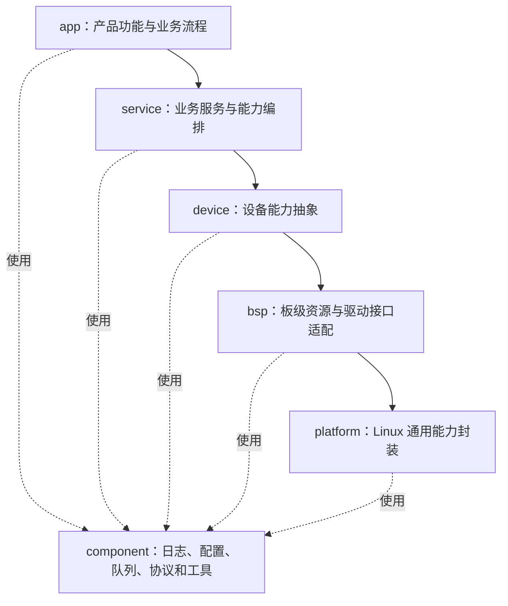

# 嵌入式软件分层架构.md
---

## 一、为什么必须分层

嵌入式 C++ 应用通常会同时发生以下变化：

| 变化类型 | 常见变化 |
| --- | --- |
| 设备变化 | 摄像头、串口设备、传感器、显示屏、通信模组或执行器更换 |
| 平台变化 | SoC、Linux 发行版、文件系统、驱动接口或厂商 SDK 更换 |
| 业务变化 | 命令定义变化、控制策略升级、状态机调整或工作流程改变 |
| 通信变化 | TCP、UDP、串口协议、MQTT、ROS 2 或其他通信方式改变 |

不分层时的典型症状：

- 业务代码直接调用 `open`、`read`、`write`、`ioctl`；
- 更换摄像头或串口协议时，大量业务代码跟着修改；
- 一个源文件同时包含业务流程、线程、Socket、设备节点和日志；
- 上层直接依赖某个厂商 SDK，后续很难替换；
- 某个底层函数修改后，多个无关模块同时受影响；
- 单元测试必须连接真实硬件才能运行；
- 代码不是不能工作，而是越来越难维护、复用和测试。

分层的目标是让不同类型的问题在各自边界内闭环，并利用 C++ 接口、命名空间和构建目标把边界落实到代码：

- 业务变化主要修改 `app` 和 `service`；
- 设备变化主要修改 `device` 和 `bsp`；
- Linux 平台变化主要修改 `platform`；
- 通用能力由 `component` 提供，避免重复实现。

---

## 二、推荐的六层架构

从上到下越接近硬件；`component` 是供多层复用的横向通用层。

| 层 | 名称 | 定位 |
| --- | --- | --- |
| **app** | 应用层 | 吸收产品和业务变化 |
| **service** | 服务层 | 提供稳定的业务通用能力 |
| **device** | 设备层 | 吸收同类设备之间的差异 |
| **bsp** | 板级支持层 | 吸收板级资源和驱动接口差异 |
| **platform** | 平台层 | 封装 Linux 用户态平台能力 |
| **component** | 组件层 | 提供与具体业务无关的横向通用组件 |

推荐关系及基本依赖方向：



`component` 可以被多个层使用，但不得反向依赖具体产品业务。


## 三、各层职责详解

### 1. app——应用层

**核心职责：回答“这个产品要做什么”。**

负责：

- 产品功能入口；
- 业务流程编排；
- 产品级状态机；
- 用户命令或外部请求处理；
- 多个服务之间的组合；
- CLI、HTTP、RPC、ROS 2 节点等对外入口；
- 应用启动、运行和退出流程；
- 将底层错误转换为产品可理解的状态。

不负责：

- 不直接访问 `/dev/*`；
- 不直接调用 `ioctl`、V4L2、termios 或厂商 SDK；
- 不直接实现串口收发、Socket 收发或文件读写细节；
- 不关心设备使用哪个驱动、波特率或硬件型号；
- 不重复实现日志、配置、队列等通用能力。

典型模块：

```text
app/
├── main.cpp
├── application.cpp
├── product_controller.cpp
├── system_state_machine.cpp
├── command_dispatcher.cpp
└── api/
    ├── cli_api.cpp
    ├── http_api.cpp
    └── ros_node.cpp
```

应用层接口示例：

```cpp
class ProductController {
public:
    Result Start();
    Result Stop();
    Result ExecuteCommand(const ProductCommand& command);
    ProductStatus GetStatus() const;
};
```

判断标准：
- 如果需求文档发生变化，这段代码是否大概率需要修改？如果是，通常属于 `app`。

---

### 2. service——服务层

**核心职责：回答“业务能力怎样稳定地提供给应用层”。**

服务层位于应用和设备之间，将多个底层能力组合成可复用服务。

负责：

- 可复用的业务能力；
- 业务用例执行；
- 多设备协作；
- 数据采集、处理、保存和上传流程；
- 控制策略或任务流程的组织；
- 业务级超时、重试和降级；
- 对上层提供稳定、简单的接口。

不负责：

- 不处理具体设备节点；
- 不直接调用 Linux 系统调用或厂商 SDK；
- 不包含具体产品页面、按钮或命令解析；
- 不把具体硬件型号暴露给 `app`；
- 不承担与业务无关的通用工具功能。

典型模块：

```bash
service/
├── acquisition_service.cpp
├── control_service.cpp
├── storage_service.cpp
├── stream_service.cpp
├── health_service.cpp
└── update_service.cpp
```

服务层接口示例：

```cpp
class IAcquisitionService {
public:
    virtual ~IAcquisitionService() = default;
    virtual Result Start(const AcquisitionOptions& options) = 0;
    virtual Result Stop() = 0;
    virtual AcquisitionStatus GetStatus() const = 0;
};
```

判断标准：
- 这项能力是否可以被多个产品功能复用，但又带有明确业务含义？如果是，通常属于 `service`。

---

### 3. device——设备层

**核心职责：回答“上层怎样以统一方式使用某一类设备”。**

设备层面向“设备能力”，不面向 Linux 文件描述符。

负责：

- 定义统一的设备接口；
- 屏蔽同类设备的型号和厂商差异；
- 设备初始化、启动、停止和状态管理；
- 将原始数据转换为统一业务数据；
- 设备级参数检查；
- 设备级错误转换；
- 设备掉线检测和恢复；
- 提供 Fake/Mock 设备供测试使用。

不负责：

- 不编排完整产品业务；
- 不处理 UI、HTTP 或产品命令；
- 不在接口中暴露 `fd`、`errno` 或厂商 SDK 类型；
- 不把 `open/read/ioctl` 散落在多个设备类中；
- 不处理与设备无关的系统能力。

典型模块：

```text
device/
├── camera/
│   ├── i_camera.hpp
│   ├── camera_device.cpp
│   └── fake_camera.cpp
├── serial_sensor/
│   ├── i_sensor.hpp
│   ├── sensor_device.cpp
│   └── sensor_protocol.cpp
└── actuator/
    ├── i_actuator.hpp
    └── actuator_device.cpp
```

设备接口示例：

```cpp
class ICamera {
public:
    virtual ~ICamera() = default;
    virtual Result Open(const CameraConfig& config) = 0;
    virtual Result Start() = 0;
    virtual Result ReadFrame(Frame& frame, Milliseconds timeout) = 0;
    virtual Result Stop() = 0;
    virtual void Close() = 0;
};
```

判断标准：
- 更换同类设备型号时，上层接口是否应该保持不变？如果是，差异应收敛在 `device`。

---

### 4. bsp——板级支持层

**核心职责：回答“当前板卡怎样访问驱动和板级资源”。**

这里的 `bsp` 指 Linux **用户态板级适配**，不包含内核驱动内部实现。

负责：

- 封装 `/dev/*` 设备节点；
- 封装 `sysfs`、`procfs` 中项目需要的接口；
- 封装 `open/read/write/close/ioctl/mmap/poll`；
- UART、I2C、SPI、GPIO、PWM、CAN 等用户态访问；
- V4L2、ALSA、DRM 等 Linux 设备接口适配；
- 对接板卡厂商提供的用户态 SDK；
- 处理短读写、`EINTR`、`EAGAIN`、超时和设备重连；
- 管理文件描述符和 SDK 句柄生命周期。

不负责：

- 不包含产品业务；
- 不定义产品状态机；
- 不解析上层业务命令；
- 不直接被 `app` 调用；
- 不将 `fd`、`errno` 或 SDK 私有结构体暴露给上层；
- 不修改 Linux 内核或驱动内部逻辑。

典型模块：

```text
bsp/
├── uart/
│   ├── uart_port.cpp
│   └── termios_config.cpp
├── gpio/
│   └── gpiod_adapter.cpp
├── video/
│   └── v4l2_capture.cpp
├── audio/
│   └── alsa_device.cpp
├── can/
│   └── socketcan_adapter.cpp
└── vendor/
    └── vendor_sdk_adapter.cpp
```

BSP 接口示例：

```cpp
class IUartPort {
public:
    virtual ~IUartPort() = default;
    virtual Result Open(const UartConfig& config) = 0;
    virtual Result Write(ByteView data, Milliseconds timeout) = 0;
    virtual Result Read(MutableByteView buffer,
                        std::size_t& received,
                        Milliseconds timeout) = 0;
    virtual void Close() = 0;
};
```

判断标准：
- 更换板卡、设备节点、驱动 ABI 或厂商 SDK 时需要修改的代码，通常属于 `bsp`。

---

### 5. platform——平台层

**核心职责：回答“上层怎样使用 Linux 通用能力而不绑定具体实现”。**

负责：

- 线程、互斥锁、条件变量和信号量封装；
- 时间、定时器和休眠；
- 文件、目录和路径操作；
- 进程、信号和守护进程能力；
- TCP、UDP、Unix Domain Socket 等基础网络能力；
- 共享内存、消息队列等 IPC 基础能力；
- 动态库加载；
- 系统信息、CPU、内存和磁盘信息读取；
- 统一封装平台差异和系统错误。

不负责：

- 不包含业务流程；
- 不定义具体设备含义；
- 不实现产品通信协议；
- 不依赖 `app`、`service` 或 `device`；
- 不为了“封装而封装”，只封装项目确实需要隔离或替换的能力。

典型模块：

```text
platform/
├── thread/
├── time/
├── filesystem/
├── network/
├── ipc/
├── process/
├── signal/
└── system/
```

平台接口示例：

```cpp
class IClock {
public:
    virtual ~IClock() = default;
    virtual SteadyTime Now() const = 0;
    virtual void SleepFor(Milliseconds duration) = 0;
};
```

判断标准：
- 这段代码是在使用 Linux 的通用能力，且未来可能需要被测试替身或其他平台实现替换吗？如果是，通常属于 `platform`。

---

### 6. component——组件层

**核心职责：提供与具体产品、设备和板卡无关的通用能力。**

负责：

- 日志；
- 配置文件解析与校验；
- 错误码和 `Result` 类型；
- 环形缓冲区、线程安全队列和对象池；
- CRC、校验和、编解码；
- JSON、YAML、Protobuf 等数据转换；
- 通用协议解析框架；
- 事件总线、观察者和回调管理；
- 通用数学、字符串和字节工具；
- 性能统计与诊断工具。

不负责：

- 不出现具体产品名称；
- 不出现具体设备型号；
- 不包含产品状态机；
- 不依赖上层业务模块；
- 不把某个项目的特殊逻辑包装成“通用组件”。

典型模块：

```bash
component/
├── logging/
├── config/
├── error/
├── buffer/
├── queue/
├── codec/
├── event/
├── metrics/
└── utility/
```

判断标准：
- 将该模块复制到另一个完全不同的项目中，是否仍然具有明确用途？如果是，通常属于 `component`。

---

## 四、依赖规则

### 1. 允许的依赖

| 调用方 | 允许依赖 |
| --- | --- |
| `app` | `service`、少量 `component` |
| `service` | `device`、`platform`、`component` |
| `device` | `bsp`、`platform`、`component` |
| `bsp` | `platform`、`component`、Linux API、厂商 SDK |
| `platform` | `component`、Linux/POSIX API |
| `component` | 标准库、经过批准的通用第三方库 |

### 2. 禁止的依赖

- 禁止 `bsp → device/service/app`；
- 禁止 `platform → device/service/app`；
- 禁止 `component → 具体业务模块`；
- 禁止 `app → bsp`；
- 禁止 `service → /dev、ioctl、厂商 SDK`；
- 禁止跨层包含其他模块的私有头文件；
- 禁止循环依赖；
- 禁止通过全局变量绕过接口共享状态。

### 3. 回调和事件

下层不得直接依赖上层。需要向上通知时，使用：

- 回调接口；
- 事件队列；
- 发布订阅；
- Future/Promise；
- IPC 消息。

下层只发布“发生了什么”，由上层决定“接下来做什么”。

例如：

```text
正确：
device 发布 CameraDisconnected
service 决定重连、降级或通知 app

错误：
device 直接调用 app.restartProduct()
```

---

## 五、模块应该放在哪一层

| 问题 | 是 | 否 |
| --- | --- | --- |
| 是否直接体现产品需求？ | 放入 `app` | 继续判断 |
| 是否是可复用的业务能力？ | 放入 `service` | 继续判断 |
| 是否描述某一类设备的统一能力？ | 放入 `device` | 继续判断 |
| 是否直接访问设备节点、驱动或厂商 SDK？ | 放入 `bsp` | 继续判断 |
| 是否封装 Linux 通用能力？ | 放入 `platform` | 继续判断 |
| 是否与业务、设备和平台无关？ | 放入 `component` | 重新检查模块职责 |

常见代码归属：

| 代码内容 | 推荐层级 |
| --- | --- |
| 产品启动流程 | `app` |
| 控制任务状态机 | `app` 或 `service` |
| 视频采集和推流流程 | `service` |
| 相机统一接口 | `device` |
| V4L2 采集实现 | `bsp` |
| termios 串口配置 | `bsp` |
| TCP Socket 基础封装 | `platform` |
| 产品通信协议 | `service` 或独立 protocol 模块 |
| CRC16 | `component` |
| 日志和配置解析 | `component` |

---

## 六、推荐目录结构

```bash
src/
├── app/                         # 产品应用层
│   ├── main.cpp
│   ├── application.cpp
│   ├── controller/
│   ├── state_machine/
│   └── api/
├── service/                     # 业务服务层
│   ├── acquisition/
│   ├── control/
│   ├── stream/
│   ├── storage/
│   └── health/
├── device/                      # 设备抽象层
│   ├── camera/
│   ├── sensor/
│   ├── actuator/
│   └── communication/
├── bsp/                         # Linux 用户态板级适配
│   ├── uart/
│   ├── i2c/
│   ├── gpio/
│   ├── v4l2/
│   ├── alsa/
│   └── vendor/
├── platform/                    # Linux 通用平台封装
│   ├── thread/
│   ├── time/
│   ├── filesystem/
│   ├── network/
│   ├── ipc/
│   └── process/
├── component/                   # 横向通用组件
│   ├── logging/
│   ├── config/
│   ├── error/
│   ├── queue/
│   ├── codec/
│   └── utility/
│
└── CMakeLists.txt
```

目录规则：

- 每层只能公开必要接口，内部实现放在自己的目录。
- 公共头文件和私有头文件分开。
- 第三方 SDK 只能由指定适配模块包含。
- 生成代码和手写代码分目录。
- 测试目录尽量与源码模块一一对应。

---

## 七、接口设计规则

### 1. 接口只表达能力

推荐：

```cpp
Result ReadFrame(Frame& frame, Milliseconds timeout);
```

不推荐：

```cpp
int ReadV4l2Frame(int fd, v4l2_buffer* buffer);
```

上层只需要知道“读取一帧”，不需要知道底层使用 V4L2。

### 2. 接口必须明确

每个公共接口必须说明：

| 项目 | 内容 |
| --- | --- |
| 输入参数 | 类型、范围、单位、所有权 |
| 输出参数 | 类型、有效期、所有权 |
| 返回值 | 成功、错误码及错误上下文 |
| 超时 | 最大阻塞时间 |
| 线程安全 | 是否允许多线程调用 |
| 生命周期 | 调用前置条件和释放方式 |
| 版本兼容 | 接口或协议升级策略 |

### 3. 不泄漏底层实现

公共接口中避免出现：

- Linux 文件描述符；
- `errno`；
- `pthread_t`；
- V4L2、ALSA、厂商 SDK 私有结构体；
- 第三方库专用类型；
- 裸指针所有权不明确的缓冲区。

---

## 八、进程与线程分层规则

### 1. 进程划分

只有满足以下情况之一时才拆分独立进程：

- 需要故障隔离；
- 需要权限隔离；
- 需要独立重启；
- 需要独立升级；
- 第三方 SDK 不稳定；
- 功能天然是独立系统服务。

进程模板：

| 进程 | 职责 | 运行用户 | 通信方式 | 重启策略 |
| --- | --- | --- | --- | --- |
| 【进程名】 | 【职责】 | 【用户】 | 【Unix Socket/共享内存等】 | 【on-failure】 |

### 2. 线程规则

- 线程归属于创建它的模块，由该模块负责停止和回收;
- 不允许创建后无人管理的分离线程;
- 阻塞 I/O 必须支持超时或退出唤醒;
- 跨线程数据优先使用有界队列;
- 禁止持锁执行设备、磁盘和网络 I/O;
- 多锁必须规定统一的加锁顺序;
- 实时线程不得执行不确定耗时操作;
- 每个共享状态必须有唯一所有者。

---

## 九、错误处理规则

错误处理分为三层：

| 层级 | 处理内容 |
| --- | --- |
| `bsp/platform` | 保存系统错误上下文，将 `errno` 或 SDK 错误转换为统一错误 |
| `device/service` | 判断是否超时、重试、重连或降级 |
| `app` | 决定产品状态、用户提示、功能关闭或进程退出 |

错误返回示例：

```cpp
enum class ErrorCode {
    kOk = 0,
    kInvalidArgument,
    kTimeout,
    kDisconnected,
    kIoError,
    kNotSupported,
    kInternalError,
};

struct Error {
    ErrorCode code;
    std::string module;
    std::string message;
    int native_code;  // 仅用于诊断，不作为上层判断依据
};
```

错误处理要求：

- 所有阻塞操作必须设置超时；
- 重试必须限制次数，并设置退避时间；
- 不允许静默忽略错误；
- 错误日志必须包含模块、操作和必要上下文；
- 无法恢复时进入预定义安全状态；
- 资源创建失败时必须逆序释放已创建资源。

---

## 十、配置与日志规则

### 1. 配置归属

| 配置 | 读取位置 | 使用位置 |
| --- | --- | --- |
| 产品功能开关 | `app` | `app/service` |
| 业务参数 | `service` | 对应服务 |
| 设备型号和逻辑参数 | `device` | 对应设备模块 |
| 设备节点、波特率、分辨率 | `bsp` | 对应板级适配 |
| 日志、队列、通用组件参数 | `component` | 对应组件 |

配置由统一配置组件加载和校验，各模块只获取属于自己的配置对象。

禁止：

- 在业务代码中硬编码 `/dev/ttyS4` 等路径；
- 在多个模块重复读取同一配置文件；
- 使用无范围、无单位、无默认值的配置项；
- 将密码、令牌或密钥写入普通配置和日志。

### 2. 日志规则

日志至少包含：

```text
时间 | 等级 | 进程 | 线程 | 模块 | 事件 | 关键信息
```

- `ERROR`：功能失败，需要处理；
- `WARN`：发生降级或可恢复异常；
- `INFO`：启停、连接和状态切换；
- `DEBUG`：调试细节，生产默认关闭；
- 高频循环中禁止无控制地打印日志。

---

## 十一、最终原则

1. **app 只描述产品要做什么。**
2. **service 负责组织稳定的业务能力。**
3. **device 统一同类设备的使用方式。**
4. **bsp 隔离板卡、驱动接口和厂商 SDK。**
5. **platform 隔离 Linux 通用平台能力。**
6. **component 提供真正与业务无关的复用能力。**
7. **上层依赖下层接口，下层不得知道具体上层业务。**
8. **更换设备时不改业务，更换业务时不改设备访问。**
9. **用独立 CMake target 固化依赖，不只依靠目录和约定。**
10. **用 RAII 管理资源，用构造函数注入依赖，用 `Result<T>` 传递跨层错误。**

如果一次需求修改需要同时改动多个不相关层级，应先检查接口边界是否设计错误。
